# Exploring the UE5 basics: SpaceInvaders

## Improvements

We start from the base game implementation: https://github.com/iestevez/spaceinvaders_ue5

We added some changes to the internal code, removing some boilerplate code, or simplifying other parts.

### InvaderMovementComponent.[h/cpp]

**InvaderMovementComponent** move its owner Actor(AInvader) only taking into account the commands given from the **AInvaderSquad**.
Once is set to free through the variable **bJumpFree**, it will stop reacting to those commands.
In the derived Blueprint **BP_Invader** we have added the new logic to do once has reached this state.

The logic set before was to create a set of points, that would make a circle path. And the invader will follow those keeping the order that were created.
This was removed due to the use of splines to define new paths. Those paths could be configured in the editor for each new kind of invader.

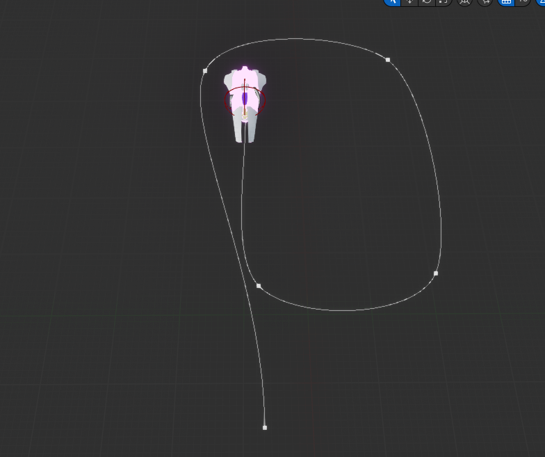

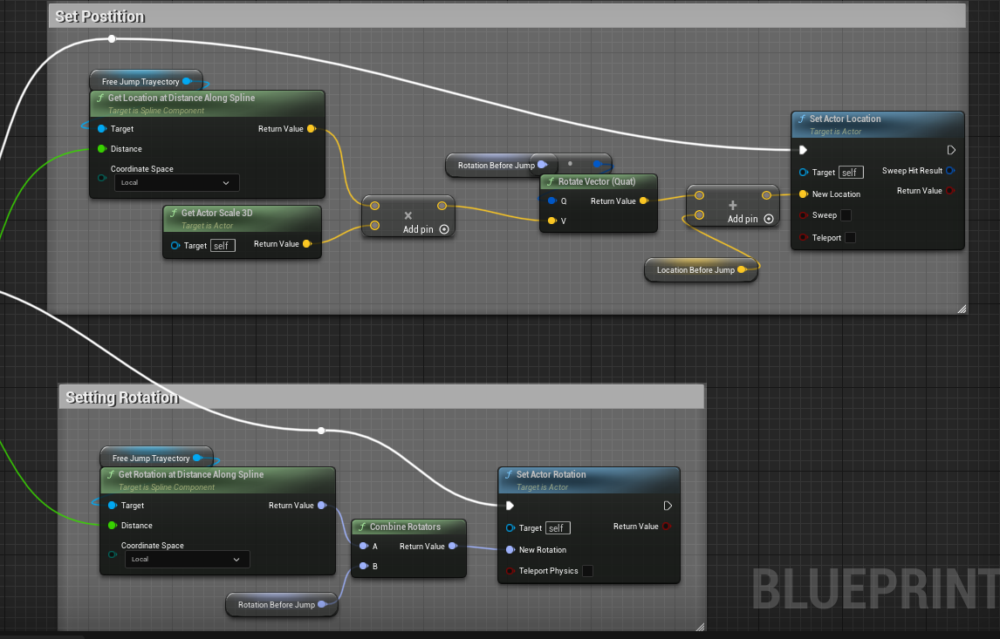

After the invader has gone through the spline, it will take the direction of the player, but facing forward to axis X.

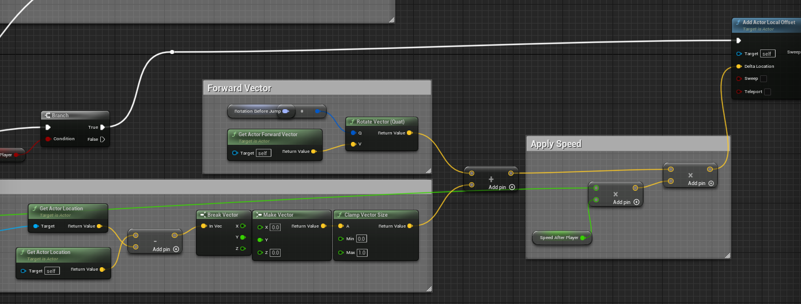

If the invader fails to kill the player, it will respawn at the top of the screen using the **ReenterVolume**.

### InvaderSquad.[h/cpp]

**InvaderSquad** controls the entire squad of invaders, just like before, but we have change spawn logic making use of **LocationVolume** set in the editor.
This allows us to set a space where we want to place the invaders, with some separation, and it will arrange them in a grid.

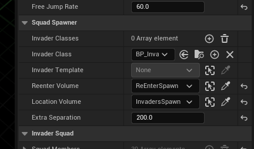

```c++
void AInvaderSquad::BuildSquad()
{
	// Clean a possible squad
	// ... omitted
	
	// Spawn Invaders
	FBoxSphereBounds SpawnableBounds = LocationVolume->GetBounds();
	// Due to the Invader scale is tweaked the bounding box are way bigger than what it should be
	auto InvaderScale = InvaderTemplate->Mesh->GetComponentScale();
	auto InvaderBounds = InvaderTemplate->Mesh->Bounds.BoxExtent * InvaderScale * 2;
	//OGEngine->AddOnScreenDebugMessage(-1, 15.0f, FColor::Yellow, FString::Printf(TEXT("X %f Y %f "), InvaderBounds.Origin.X, InvaderBounds.Origin.Z));	
	
	auto Spacing_X = (InvaderBounds.X) + ExtraSeparation;
	auto Spacing_Y = (InvaderBounds.Y) + ExtraSeparation;
	auto min = SpawnableBounds.Origin - SpawnableBounds.BoxExtent;
	auto max = SpawnableBounds.Origin + SpawnableBounds.BoxExtent;

	auto centerX = Spacing_X / 2 * (FGenericPlatformMath::Fmod(FMath::Abs(max.X - min.X), Spacing_X) /
		ExtraSeparation);
	auto centerY = Spacing_Y / 2 * (FGenericPlatformMath::Fmod(FMath::Abs(max.Y - min.Y), Spacing_Y) /
		Spacing_Y);

	int32 InvadersCount = 0;
	FVector SpawnLocation;
	// Invader Forward is opposite to Player Forward (Yaw rotation)
	FRotator SpawnRotation = FRotator(0.0f, 180.0f, 0.0f);
	FActorSpawnParameters SpawnParameters;
	AInvader* SpawnedInvader;

	for (float i = min.X; i < max.X; i += Spacing_X)
	{
		for (float j = min.Y; j < max.Y; j += Spacing_Y)
		{
			SpawnLocation = FVector(centerX + i, centerY + j, SpawnableBounds.Origin.Z);
			SpawnParameters.SpawnCollisionHandlingOverride = ESpawnActorCollisionHandlingMethod::AlwaysSpawn;
			SpawnParameters.Template = InvaderTemplate;
			SpawnedInvader = GetWorld()->SpawnActor<AInvader>(InvaderClass, SpawnLocation, SpawnRotation, SpawnParameters);
			SpawnedInvader->SetPositionInSquad(InvadersCount);
			// We could attach the invaders to the squad to move only one transform
			// SpawnedInvader->AttachToActor(this, ... , "");
			++InvadersCount;
			SquadMembers.Add(SpawnedInvader);
		}
	}
	NumberOfMembers = InvadersCount;
	State = InvaderMovementType::RIGHT;
}
```

This was set on first place into a **OnConstruction** method, but it crashes the editor when trying to compile the Invader blueprint. So, I recommend to not **SpawnActors** in the **OnConstruction** method, at least those that are create with BP.

### Leaderboard

To implement this we create a new **GameInstance** class, that will hold the information of the leaderboard. The information is represented
in the **UScoreData** class, this allows to easily implement algorithms like sorting in c++ rather than a possible spaghetti blueprint.

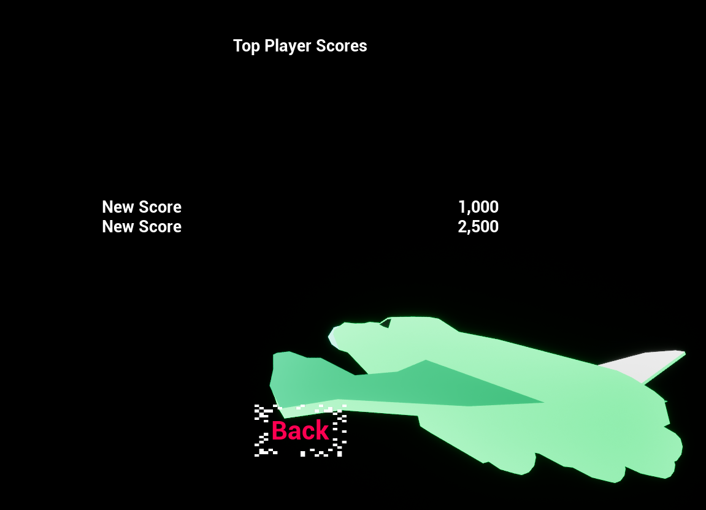

To implement the leaderboard we create a new widget that can be accessed through the Main Menu.


This "tab" can be switched using the two events implemented in the **BP_MenuHUD**.

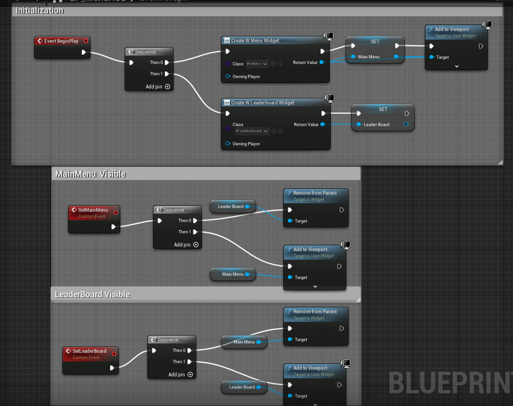

The score is represented with a list view, that we fill through the **ScoreData** in the **GameInstance**.

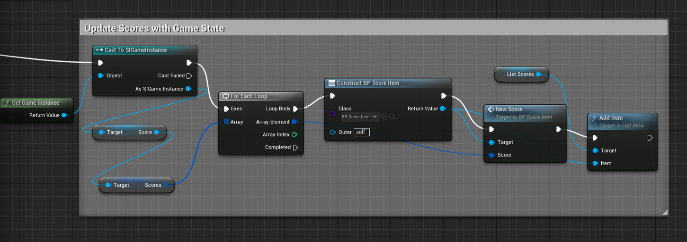

And for each entry we extract the data to feed the widgets.

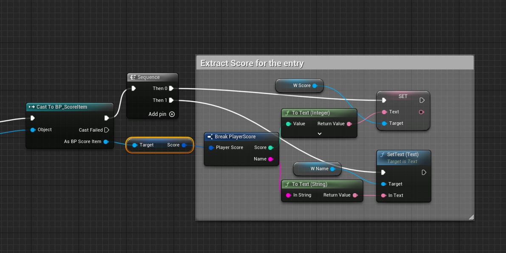

### Lives Icons

Before, Game Hud require an individual setting of the icon visibility. So, each icon have the exact same logic just changing the index.
This has been simplified into a loop which set the visibility of those icons in one go.

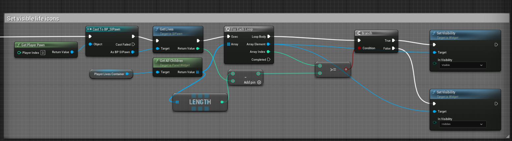

### Material

We added a new material to the background, with a parallax effect using stars and nebula clouds

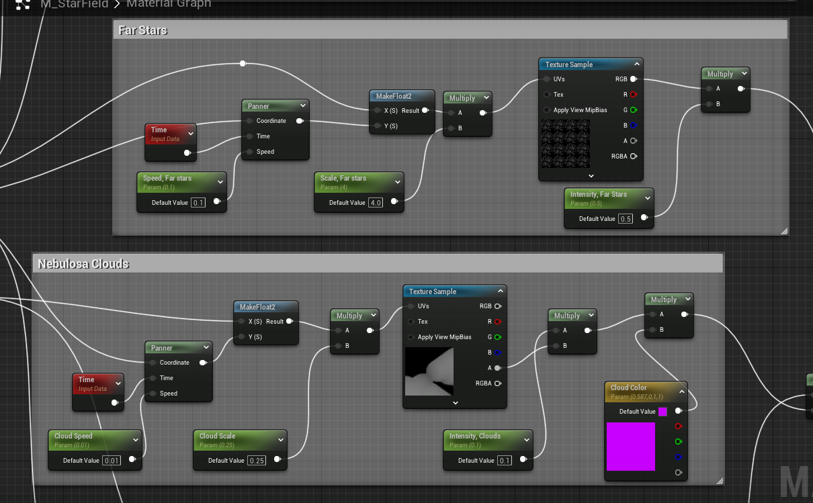

And the effect:

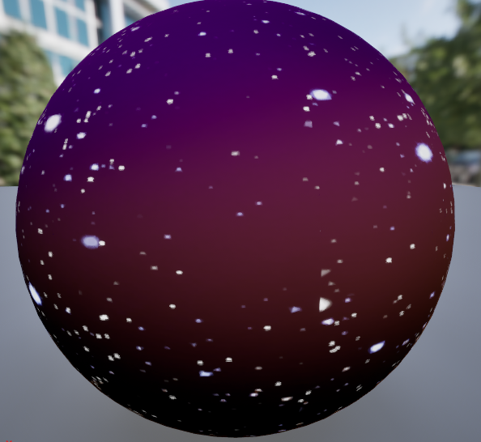

### Niagara Particles

We added a new Niagara System, that gets triggered when the invaders get destroyed. This is done through C++ code.

```c++
// Invader.cpp
UNiagaraFunctionLibrary::SpawnSystemAttached(NFXExplosion, RootComponent, NAME_None, FVector(0.f), FRotator(0.f), EAttachLocation::KeepRelativeOffset, true);
```


### Difficulty

We simply increase the difficulty by increasing some spawn values.

```c++
// InvaderSquad.cpp
void AInvaderSquad::IncreaseLevel()
{
	FreeJumpRate *= 0.9;
	InvaderTemplate->FireRate = InvaderTemplate->FireRate * 0.9;
}
```

So, to understand why lowering the FreeJumpRate would increase the difficulty, we need to look at the new formula used.
`1-e^(-TimeFromLastShot * DeltaTime/ YourRate)`

With this, we can define **YourRate**, as the time that takes to trigger. If we set it to 20s, it means that will take around 20s to trigger again.

```c++
// Invader.cpp
// ... omitted
float val = FMath::RandRange(0.0f, 1.0f);
if (val < 1.0 - FMath::Exp(-TimeFromLastShot * DeltaTime / FireRate))
{
    Fire();
}
// ... omitted
```

Another difficulty added, it was to make reappear the invaders again, once they have gone through the bottom screen. This is done only for the case of free jump invaders.

```c++
// InvaderSquad.cpp
void AInvaderSquad::ReenterFromTop(AInvader* Invader)
{
    FVector InvaderLocation = Invader->GetActorLocation();
    // We could use a new random location inside that reenter volume
    float XAxis = ReenterVolume->GetActorLocation().X;
    Invader->SetActorLocation(FVector(XAxis, InvaderLocation.Y, InvaderLocation.Z));
}
```

## In Game

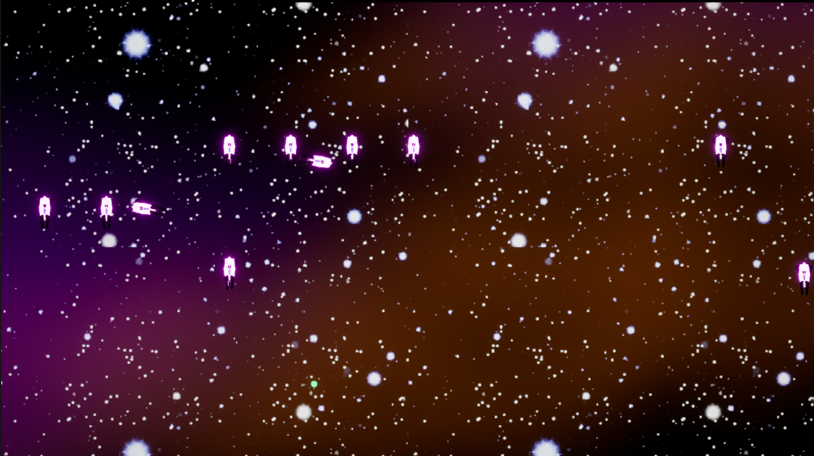

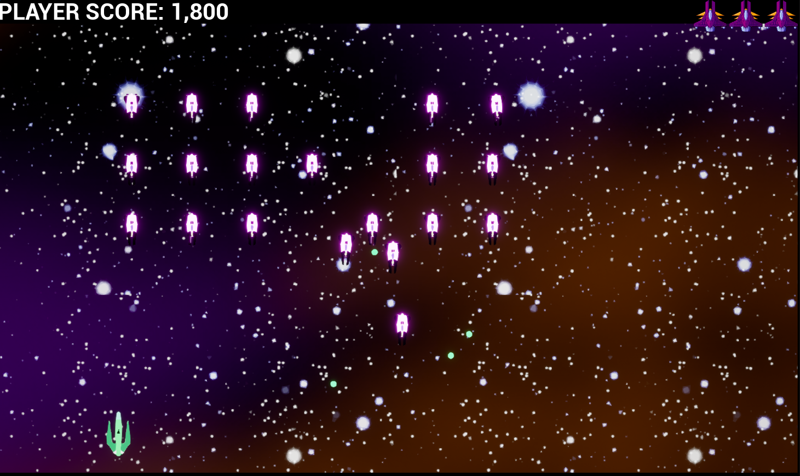